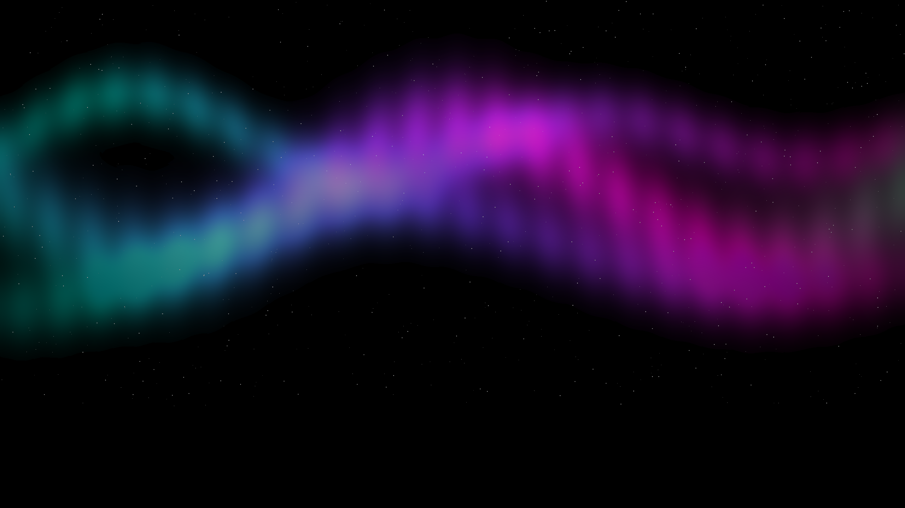

<div align="center">



# 🌌 Neon Aurora OLED Theme

**A true-black, neon-accented theme for Microsoft Edge, built for OLED screens.**


</div>

---

## ✨ Features

- 🖤 **True black (`#000000`)** window frame, toolbar and open tab, so OLED pixels switch fully off
- 🌈 **Neon aurora New Tab background** in cyan, violet and magenta on pure black, 2560 × 1440
- 🟢 **Highlighted open tab** with neon green text, while inactive tabs sit in dark gray with dimmer cyan text
- 💠 **Neon address bar text** in aqua-green, which also colors the search suggestions
- 🟡 **Neon bookmark text** and 🔵 cyan toolbar icons for high contrast
- 🪶 **Lightweight**: a single manifest and one image. No scripts, no permissions, no data collected

---

## 🎨 Color Palette

| Element | Color | Value |
|---|---|---|
| Window frame, toolbar, open tab |  | `rgb(0, 0, 0)` |
| Inactive tabs |  | `rgb(34, 34, 34)` |
| Open tab text |  | `rgb(57, 255, 20)` |
| Inactive tab text |  | `rgb(0, 200, 200)` |
| Toolbar text and icons |  | `rgb(0, 255, 255)` |
| Address bar text and suggestions |  | `rgb(0, 255, 200)` |
| Bookmark text |  | `rgb(255, 255, 0)` |
| New Tab links |  | `rgb(255, 0, 255)` |

---

## 📦 Installation

This theme is installed locally ("sideloaded"), which takes about 30 seconds.

1. **Download** this repository: click **Code → Download ZIP**, then extract it.
2. Keep the extracted folder somewhere permanent. Edge reads the theme from it, so don't delete it afterwards.
3. Open Edge and go to `edge://extensions`.
4. Turn on **Developer mode**.
5. Click **Load unpacked** and select the folder that contains `manifest.json`.

The theme applies immediately.

> **Tip:** if Edge shows a "developer mode extensions" prompt at startup, you can dismiss it.

### Recommended settings

| Setting | Where | Why |
|---|---|---|
| Overall appearance: **Dark** | `edge://settings/appearance` | Makes Edge's menus and settings pages dark to match |
| Auto Dark Mode for Web Contents: **Enabled** | `edge://flags/#enable-force-dark` | Optional. Darkens websites too (restart required) |
| Windows 11 visual effects: **Off** | `edge://settings/appearance` | Mica effects may override the frame color |

---

## 🛠️ Customization

All colors live in `manifest.json` as `[R, G, B]` values. Edit one, then click the **reload** icon on the theme card at `edge://extensions`.

```json
"colors": {
  "tab_text": [57, 255, 20],
  "omnibox_text": [0, 255, 200],
  "background_tab": [34, 34, 34]
}
```

| Key | Controls |
|---|---|
| `frame` | Title bar / window frame |
| `toolbar` | Toolbar **and the open tab** (Edge always paints them the same color) |
| `background_tab` | Inactive tabs |
| `tab_text` / `tab_background_text` | Open tab text / inactive tab text |
| `omnibox_text` / `omnibox_background` | Address bar text and suggestions / address bar background |
| `bookmark_text` | Favorites bar text |
| `toolbar_text`, `toolbar_button_icon` | Toolbar labels and icons |

To swap the New Tab background, replace `images/ntp_background.png` with your own image (2560 × 1440 or larger works well).

---

## 🧩 Compatibility

- Built for **Microsoft Edge** (Chromium-based) using the standard Chromium theme format.
- Other Chromium browsers may accept it too, but this has not been tested.
- **Not available on the Microsoft Edge Add-ons store.** The store does not accept themes, so install it as described above.

---

## ❓ Troubleshooting

<details>
<summary><b>The title bar or tabs don't change color</b></summary>

- Make sure the theme shows as enabled at `edge://extensions` with no errors.
- Edge allows only one theme at a time. Switch back to the default theme in `edge://settings/appearance`, then reload this one.
- Turn off **Show Windows 11 visual effects in browser**. Mica can override the frame color.
- Quick test: set `"frame"` to `[255, 0, 0]` and reload. If the title bar turns red, the theme works and something else was overriding the black.
</details>

<details>
<summary><b>The open tab looks the same as the toolbar</b></summary>

That's by design. Edge paints the open tab with the toolbar color, so the open tab stands out by contrast with the gray inactive tabs and by its neon green text.
</details>

<details>
<summary><b>Edge shows a warning about developer mode extensions</b></summary>

This appears for every unpacked extension or theme. It's safe to dismiss.
</details>

---

## 🗂️ Project Structure

```
neon-aurora-oled-edge-theme/
├── manifest.json        # Theme definition (colors, image, properties)
├── images/
│   └── ntp_background.png   # Neon aurora New Tab background
├── store_logo_300.png   # 300×300 logo
├── README.md
└── LICENSE
```

---

## 📝 Changelog

| Version | Notes |
|---|---|
| **1.2** | Window, toolbar and open tab are pure black; inactive tabs are dark gray so the open tab stands out |
| 1.1 | Experimental violet toolbar (reverted, as it tinted the whole window) |
| 1.0 | Initial release: neon aurora background and neon address bar text |

---

## 🤝 Contributing

Ideas and improvements are welcome. Open an issue to suggest a color tweak or a new background, or send a pull request.

## 📄 License

Released under the [MIT License](LICENSE).

<div align="center">

Made for dark screens 🌌

</div>
